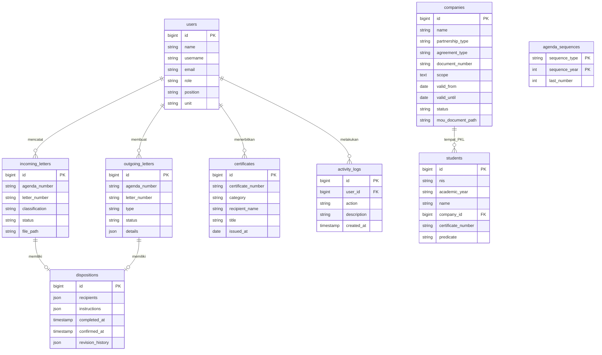

# Rancangan Basis Data (ERD)

```mermaid
erDiagram
  users ||--o{ incoming_letters : mencatat
  users ||--o{ outgoing_letters : membuat
  users ||--o{ certificates : menerbitkan
  users ||--o{ activity_logs : melakukan
  incoming_letters ||--o| dispositions : memiliki
  outgoing_letters ||--o| dispositions : memiliki
  companies ||--o{ students : tempat_PKL
  users { bigint id PK string name string username string email string role string position string unit }
  incoming_letters { bigint id PK string agenda_number string letter_number string classification string status string file_path }
  outgoing_letters { bigint id PK string agenda_number string letter_number string type string status json details }
  dispositions { bigint id PK json recipients json instructions timestamp completed_at timestamp confirmed_at json revision_history }
  companies { bigint id PK string name string partnership_type string agreement_type string document_number text scope date valid_from date valid_until string status string mou_document_path }
  students { bigint id PK string nis string academic_year string name bigint company_id FK string certificate_number string predicate }
  certificates { bigint id PK string certificate_number string category string recipient_name string title date issued_at }
  activity_logs { bigint id PK bigint user_id FK string action string description timestamp created_at }
  agenda_sequences { string sequence_type PK int sequence_year PK int last_number }
```

`agenda_sequences` menjamin nomor agenda surat masuk/keluar dan sertifikat berurutan per tahun.
